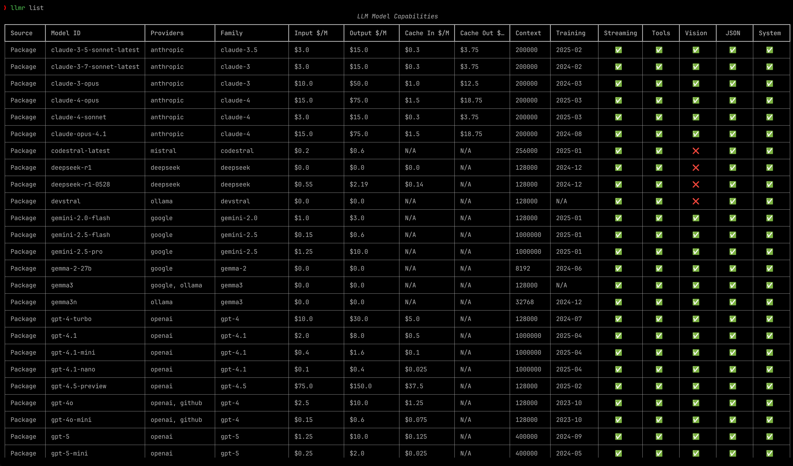

# LLM Registry

[]()
[]()
[]()
[]()

A Python package for managing LLM model capabilities across multiple providers. Track pricing, features, and limitations in one place.

## Why LLM Registry?

Working with multiple LLM providers means juggling different pricing models, feature sets, and API parameters. LLM Registry solves this by providing a single source of truth for model metadata.

Check a model's capabilities before making API calls, compare costs across providers, and maintain your own custom model configurations alongside the built-in registry.

## Features

- **Unified Interface**: Query model capabilities across OpenAI, Anthropic, Google, Cohere, Mistral, Meta, and more
- **Cost Tracking**: Input/output token costs, cached token pricing, and context window limits
- **Feature Discovery**: Check support for streaming, tools, vision, JSON mode, and system prompts
- **Dual Storage**: Built-in registry with 100+ models, plus local storage for custom configurations
- **Multi-Provider Support**: Single model can be associated with multiple providers
- **CLI & Python API**: Use from the command line or integrate into your code

## Installation

```bash
pip install llm-registry
```

## Quick Start

### Python API

List all available models:

```python
from llm_registry import CapabilityRegistry, Provider
registry = CapabilityRegistry()
models = registry.get_models()
for model in models:
    print(model)
```

Check a specific model's capabilities:

```python
model = registry.get_model("gpt-5")
if model.api_params.stream:
    # Model supports streaming
    print(f"Cost: ${model.token_costs.input_cost}/M input tokens")
```

Add custom models:

```python
from llm_registry import CapabilityRepository, Provider
from llm_registry.utils import create_model_capability

new_model = create_model_capability(
    model_id="gpt-5",
    provider=Provider.OPENAI,
    model_family="GPT-5",
    input_cost=0.01,
    output_cost=0.03,
    context_window=8192,
    supports_streaming=True,
    supports_tools=True
)

repo = CapabilityRepository()
repo.save_model_capabilities(new_model)
```

### Command Line Interface

List models:

```bash
llmr list
llmr list --provider openai
```



Get detailed information:

```bash
llmr get gpt-5
llmr get gpt-5 --json
```

Example output:

```json
{
  "model_id": "o1",
  "providers": ["openai"],
  "model_family": "o1",
  "api_params": {
    "max_tokens": true,
    "temperature": false,
    "top_p": false,
    "stream": true
  },
  "features": {
    "vision": true,
    "tools": true,
    "json_mode": true,
    "system_prompt": false
  },
  "token_costs": {
    "input_cost": 15.0,
    "output_cost": 60.0,
    "cache_input_cost": 7.5,
    "context_window": 200000,
    "training_cutoff": "2023-10"
  }
}
```

Manage custom models:

```bash
# Add a model
llmr add custom-model \
    --provider openai \
    --input-cost 0.01 \
    --output-cost 0.03 \
    --stream \
    --tools

# Update a model
llmr update custom-model --input-cost 0.005

# Delete a model
llmr delete custom-model --provider openai
```

## Model Metadata

Each model tracks:

- **Basic Information**: Provider(s), model ID, model family
- **Costs**: Input/output token costs (per 1M tokens), cached token pricing
- **API Parameters**: max_tokens, temperature, top_p, streaming support
- **Features**: Vision, tools/function calling, JSON mode, system prompts
- **Limits**: Context window size, training data cutoff date

## Configuration

Model data is stored in `~/.llm-registry` by default. Override with:

```python
repo = CapabilityRepository(data_dir=Path("/custom/path"))
```

Or via CLI:

```bash
llmr list --data-dir /custom/path
```

## Contributing

Contributions welcome! Report bugs, suggest features, or submit pull requests.

## License

MIT License. See `LICENSE` for details.
